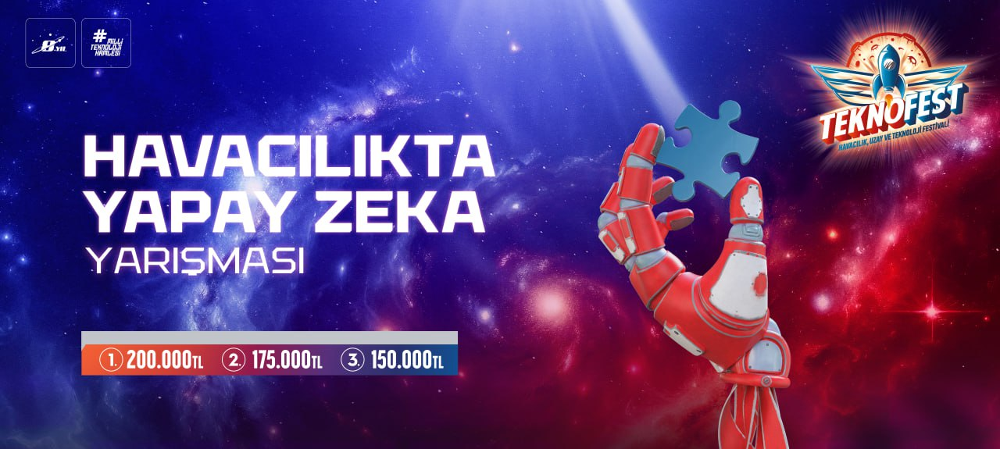
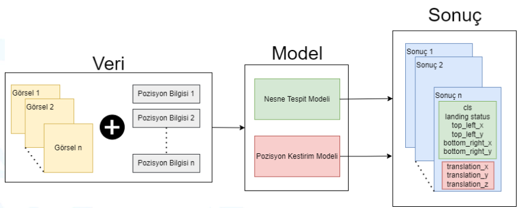

# Havacılıkta Yapay Zeka Yarışması 2025 - TEKNOFEST

Bu depo, TEKNOFEST kapsamında düzenlenen "Havacılıkta Yapay Zeka Yarışması 2025" için resmi GitHub deposudur. Yarışma, yapay zeka teknolojilerini havadan görüntüler alanında kullanarak, bu alandaki bilgi birikimi ve yetişmiş insan gücünü artırmayı amaçlamaktadır.

## Geçmiş sene veri setleri

## Yarışma Hakkında

"Havacılıkta Yapay Zeka" yarışması, havadan görüntüler alanında karşılaşılabilecek problemlere yenilikçi çözümler üretmeyi hedefleyen bir etkinliktir. Yarışma, katılımcıların uçan arabalar için çevresel farkındalığı ve güvenliği artıran yapay zeka yazılımları geliştirmelerini ve test etmelerini sağlayacak bir platform sunar.

## Katılım Koşulları

- Katılımcılar, Türkiye ve yurt dışında öğrenim gören lise, üniversite öğrencileri ve mezunları (Lisans, Ön lisans, Yüksek Lisans, Doktora ve Açık Öğretim dahil) takım halinde katılabilirler.
- Takımlar en az 2 ve en fazla 5 kişiden oluşmalıdır. Danışmanlar bu sayıya dahil değildir.

## Yarışma Görevleri

- [**Nesne Tespiti:**](https://github.com/TEKNOFEST-YARISMALAR/ulasimda-yapay-zeka-yarismasi/blob/main/nesne%20tespiti.gif) Uçan arabanın kamera verilerini kullanarak taşıt ve insanların tespit edilmesi.
  
- [**Pozisyon Tespiti:**](https://github.com/TEKNOFEST-YARISMALAR/ulasimda-yapay-zeka-yarismasi/blob/main/pozisyon%20kestirimi.gif) Uçan arabanın GPS sistemleri devre dışı kaldığında görsel verilerle pozisyon kestirimi yapılması.
  
  
## Yarışma Görevlerinin Değerlendirilmesi
- Nesne Tespiti: MAP (IOU treshold = 0.5)
- Pozisyon Kestirimi : [rpg trajectory evaluation](https://github.com/uzh-rpg/rpg_trajectory_evaluation?tab=readme-ov-file#single-trajectory-estimate) (Absolute Error>>Translation>>RMSE)

## Donanım ve Yazılım Gereksinimleri

- Yarışma sırasında tüm takımlar geliştirdikleri yazılımları kendi bilgisayarlarında çalıştıracaklardır.
- Takımların, ethernet girişine sahip cihazları kullanmaları ve internet bağlantısının kesinlikle yasak olduğu bir ortamda çalışmaları gerekmektedir.

## Puanlama ve Ödüller

Puanlama, nesne tespiti ve pozisyon kestirimi görevlerinin başarısına göre yapılacaktır. Ayrıntılı puanlama kriterleri ve ödüller yarışma teknik şartnamesinde belirtilmiştir.

## Takvim

- **📄 Teknik Şartnamenin İlanı:** 24 Ocak 2025  
- **📝 Yarışma Son Başvuru Tarihi:** 1 Mart 2025  
- **🎥 Örnek Eğitim Videosunun (Etiketsiz) Teslimi:** 10 - 28 Mart 2025  
- **📑 Ön Tasarım Raporu Son Teslim Tarihi:** 25 Nisan 2025, saat 17:00  
- **✅ 1. Ön Elemeyi Geçen Takımların Açıklanması (Ön Tasarım Raporu Sonuçlarına Göre):** 23 Mayıs 2025  
- **❓ Takımlarla Soru-Cevap Toplantısı:** 23 - 30 Mayıs 2025  
- **💻 Çevrim İçi Yarışma Simülasyonu:** 20 Haziran 2025  
- **✅ 2. Ön Elemeyi Geçen Takımların Açıklanması (Simülasyon Sonuçlarına Göre):** 18 Temmuz 2025  
- **🏁 Yarışma Finalleri:** Ağustos - Eylül 2025  
- **📘 Final Tasarım Raporu Son Teslim Tarihi:** Ağustos - Eylül 2025 (Kesin tarih daha sonra duyurulacaktır)

## İletişim

Daha ayrıntılı bilgiler için [Yarışmanın resmi web sitesi](https://teknofest.org/tr/competitions/competition/43)ni ziyaret edebilir  [Genel Şartname](https://cdn.teknofest.org/media/upload/userFormUpload/2025_HAVACILIKTA_YAPAY_ZEKA_TR_v3_Cr0FM.pdf) ve [Teknik Şartnameyi](https://cdn.teknofest.org/media/upload/userFormUpload/2025_TEKNOFEST_Havac%C4%B1l%C4%B1kta_Yapay_Zeka_Yarismasi_Teknik_Sartname_gzZkY.pdf) inceleyebilirsiniz.

Daha fazla bilgi ve sorularınız için [TEKNOFEST resmi web sitesi](https://www.teknofest.org) üzerinden bizimle iletişime geçebilirsiniz.
